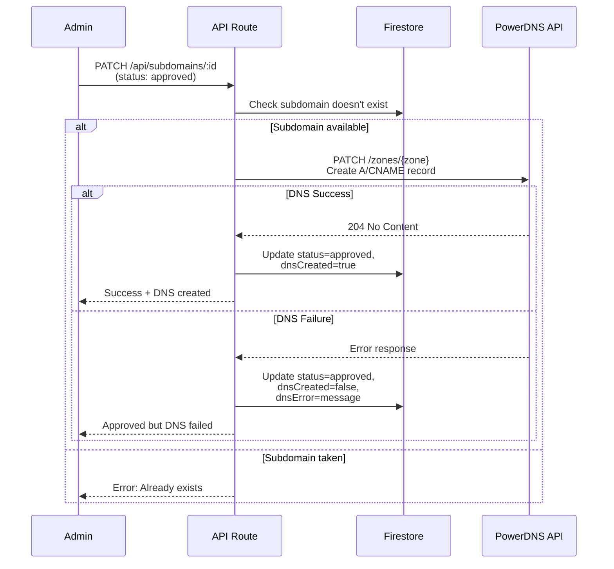

# OpenSubdomain Platform - Implementation Plan

A lightweight, modern subdomain management platform built with **Next.js** and **Firebase**, optimized for minimal resource usage (200MB RAM excluding Node.js).

## User Review Required

> [!IMPORTANT]
> **Updated Architecture**
> Based on user feedback:
> - **Framework:** Next.js with API routes (no separate backend)
> - **Database:** Firebase Firestore (serverless, no local DB overhead)
> - **Authentication:** Firebase Authentication for admin panel
> - **DNS Provider:** PowerDNS with HTTP API for automatic record creation
> - **Hosting:** Vercel/Firebase Hosting recommended
> 
> **PowerDNS Integration:**
> - When admin approves subdomain → automatically creates DNS A/CNAME record via PowerDNS API
> - Uses PowerDNS REST API (PATCH `/api/v1/servers/localhost/zones/{zone_name}`)
> - Configurable parent zone (e.g., `private.iishanto.com.`)
> 
> **Please confirm:**
> 1. PowerDNS API endpoint URL and API key
> 2. Parent zone name (e.g., `private.iishanto.com.`)
> 3. Default target IP for subdomain A records
> 4. Do you have a Firebase project already set up?

> [!WARNING]
> **Memory Optimization Strategy**
> To meet the 200MB RAM requirement:
> - Minimal Next.js config (disable unused features)
> - No server-side state (Firebase handles all data)
> - Static generation for public pages
> - API routes only when needed
> - Vanilla CSS (no Tailwind/CSS-in-JS overhead)
> - Tree-shaking and code splitting

> [!CAUTION]
> **Security Architecture - Critical**
> 
> **Server-Side ONLY (Next.js API Routes):**
> - All PowerDNS API calls (API key never exposed to client)
> - All Firebase Admin SDK operations (service account server-only)
> - All Firestore write operations (create/update/delete subdomains)
> - Rate limiting and validation
> 
> **Client-Side (Browser):**
> - Firebase Auth UI for admin login
> - Firestore read operations with security rules
> - UI rendering and form validation
> - No access to PowerDNS or Firebase Admin credentials
> 
> **Key Principle:** Client never directly touches PowerDNS or Firebase Admin. All sensitive operations go through secured Next.js API routes.

## Proposed Changes

### Project Initialization

#### [NEW] [package.json](file:///c:/Users/HP/WebstormProjects/opensubdomain/package.json)

**Core dependencies:**
- `next` (~12MB) - React framework
- `react` & `react-dom` (~130KB combined)
- `firebase` (~200KB tree-shaken) - Firestore + Auth only
- `validator` - Input validation

**Dev dependencies:**
- None for production build

**Scripts:**
```json
{
  "dev": "next dev",
  "build": "next build",
  "start": "next start -p 3000",
  "export": "next build && next export"
}
```

**Total estimated memory:** ~140-170MB including Next.js runtime

---

### Next.js Configuration

#### [NEW] [next.config.js](file:///c:/Users/HP/WebstormProjects/opensubdomain/next.config.js)

Memory-optimized configuration:
- Disable image optimization (use external CDN)
- Enable SWC minification
- Disable source maps in production
- Static export where possible
- Custom webpack config to reduce bundle size

```js
module.exports = {
  reactStrictMode: true,
  swcMinify: true,
  images: { unoptimized: true },
  compiler: { removeConsole: true },
  experimental: { optimizeCss: true }
}
```

---

### Firebase Configuration

#### [NEW] [lib/firebase.js](file:///c:/Users/HP/WebstormProjects/opensubdomain/lib/firebase.js)

**Client-side Firebase initialization:**
- **Runs in:** Browser only
- Initialize only Firebase Auth module
- Tree-shake unused services (Firestore client read-only if needed)
- Used for admin login UI
- **DOES NOT** include Admin SDK credentials

#### [NEW] [lib/firebase-admin.js](file:///c:/Users/HP/WebstormProjects/opensubdomain/lib/firebase-admin.js)

**Server-side Firebase Admin SDK:**
- **Runs in:** Next.js API routes ONLY
- Initialize with service account (never sent to client)
- Full Firestore access for CRUD operations
- Verify Firebase Auth tokens from client
- **Security:** Import only in API route files, never in pages/components

#### [NEW] [lib/powerdns-client.js](file:///c:/Users/HP/WebstormProjects/opensubdomain/lib/powerdns-client.js)

**Server-side PowerDNS API client:**
- **Runs in:** Next.js API routes ONLY
- Create DNS records (A, CNAME) via PowerDNS HTTP API
- Delete DNS records
- Update existing records
- Uses `fetch` API with `X-API-Key` header (server environment variable)
- Handles trailing dot notation for zone/record names
- Error handling and retry logic
- **Security:** API key from `process.env`, never exposed to client
- **Implementation based on:** PowerDNS HTTP API documentation provided in `.github/antigravity_instructions.md`
  - Uses `PATCH /api/v1/servers/localhost/zones/{zone}` for record operations
  - Follows `rrsets` JSON format with `changetype: REPLACE/DELETE`
  - Includes `X-API-Key` header authentication

**Key methods:**
```js
- createARecord(subdomain, targetIP)    // Server-side only
- createCNAMERecord(subdomain, target)  // Server-side only
- deleteRecord(subdomain, recordType)   // Server-side only
- updateRecord(subdomain, recordType, content)
```

---

### Firestore Data Model

#### Firestore Collections Structure

**`subdomains` collection:**
```js
{
  id: auto-generated,
  subdomainName: string,
  userEmail: string,
  targetUrl: string,           // Target IP or domain for DNS record
  recordType: 'A' | 'CNAME',   // DNS record type
  status: 'pending' | 'approved' | 'rejected',
  dnsCreated: boolean,         // Whether DNS record was created in PowerDNS
  dnsError: string | null,     // Any DNS creation error message
  createdAt: timestamp,
  approvedAt: timestamp | null,
  rejectedAt: timestamp | null,
  adminNotes: string,
  userId: string (optional, for logged-in users)
}
```

**Indexes:**
- `status` (for filtering)
- `createdAt` (for sorting)
- `subdomainName` (for uniqueness check)

#### Firestore Security Rules

**Critical for security - prevents client from bypassing API routes:**

```javascript
rules_version = '2';
service cloud.firestore {
  match /databases/{database}/documents {
    // Subdomains collection - READ ONLY from client
    match /subdomains/{subdomainId} {
      // Allow read for anyone (to check availability in real-time)
      allow read: if true;
      
      // DENY all writes from client
      // All writes must go through Next.js API routes
      allow write: if false;
    }
  }
}
```

**Rationale:** 
- Client can read subdomain data for UI display
- All create/update/delete operations forced through API routes
- API routes use Firebase Admin SDK which bypasses security rules
- This prevents users from directly manipulating Firestore or calling PowerDNS

---

### API Routes (Next.js)

> [!IMPORTANT]
> **All API routes run server-side only.** They have access to:
> - Firebase Admin SDK (full Firestore access)
> - PowerDNS API credentials
> - Server environment variables
> 
> **Client cannot bypass these routes** - all subdomain operations must go through these secured endpoints.

#### [NEW] [pages/api/subdomains/index.js](file:///c:/Users/HP/WebstormProjects/opensubdomain/pages/api/subdomains/index.js)

**GET** - List all subdomain requests (admin only, paginated)
- Verify Firebase Auth token (server-side)
- Query Firestore using Admin SDK
- Cursor-based pagination

**POST** - Create new subdomain request
- Validate input (subdomain format, email, target)
- Rate limiting (in-memory, per IP)
- Create Firestore document using Admin SDK
- **Does NOT create DNS record** (only on approval)
- Return created subdomain data

#### [NEW] [pages/api/subdomains/[id].js](file:///c:/Users/HP/WebstormProjects/opensubdomain/pages/api/subdomains/[id].js)

**GET** - Get specific subdomain details
- Public endpoint (no auth required)
- Fetch from Firestore using Admin SDK

**PATCH** - Update status (admin only)
- **Server-side workflow when status → 'approved':**
  1. Verify Firebase Auth token
  2. Validate subdomain availability in Firestore
  3. **Call PowerDNS API** (server-side) to create DNS record
  4. Update Firestore with result:
     - Success: `{ status: 'approved', dnsCreated: true, approvedAt: now }`
     - Failure: `{ status: 'approved', dnsCreated: false, dnsError: message }`
  5. Return response to admin
- **Security:** PowerDNS credentials never leave server

**DELETE** - Delete subdomain (admin only)
- Verify Firebase Auth token
- If `dnsCreated === true`, call PowerDNS API to delete DNS record (server-side)
- Delete Firestore document using Admin SDK
- Log error if DNS deletion fails (don't block Firestore deletion)

#### [NEW] [pages/api/subdomains/check.js](file:///c:/Users/HP/WebstormProjects/opensubdomain/pages/api/subdomains/check.js)

**GET** - Check subdomain availability
- Query Firestore for existing subdomain
- Return boolean availability status

#### [NEW] [pages/api/auth/login.js](file:///c:/Users/HP/WebstormProjects/opensubdomain/pages/api/auth/login.js)

**POST** - Admin login with Firebase Auth
- Verify credentials
- Return session token

---

### Frontend Pages

#### [NEW] [pages/index.js](file:///c:/Users/HP/WebstormProjects/opensubdomain/pages/index.js)

Landing page (Static Generation):
- Hero section with gradient
- Subdomain request form
- Feature highlights
- Real-time availability check
- Modern glassmorphic design

#### [NEW] [pages/admin/index.js](file:///c:/Users/HP/WebstormProjects/opensubdomain/pages/admin/index.js)

Admin dashboard (Client-side protected):
- Firebase Auth check
- Subdomain management table
- Approve/reject/delete actions
- Search and pagination
- Real-time updates using Firestore snapshots

#### [NEW] [pages/admin/login.js](file:///c:/Users/HP/WebstormProjects/opensubdomain/pages/admin/login.js)

Admin login page:
- Firebase Auth UI
- Redirect on successful login

#### [NEW] [pages/_app.js](file:///c:/Users/HP/WebstormProjects/opensubdomain/pages/_app.js)

App wrapper:
- Global CSS import
- Firebase context provider
- Minimal layout wrapper

---

### Styling (Vanilla CSS)

#### [NEW] [styles/globals.css](file:///c:/Users/HP/WebstormProjects/opensubdomain/styles/globals.css)

Global styles:
- CSS reset
- CSS custom properties for theming
- Typography using Google Fonts
- Dark mode variables

#### [NEW] [styles/Home.module.css](file:///c:/Users/HP/WebstormProjects/opensubdomain/styles/Home.module.css)

Landing page styles:
- Hero section with gradient background
- Glassmorphism card effects
- Smooth animations and transitions
- Responsive grid layouts
- Mobile-first design

#### [NEW] [styles/Admin.module.css](file:///c:/Users/HP/WebstormProjects/opensubdomain/styles/Admin.module.css)

Admin panel styles:
- Data table styling
- Action buttons
- Filters and search bar
- Pagination controls
- Status badges

**Design Principles:**
- No CSS framework (pure CSS modules)
- Modern aesthetics with gradients and glass effects
- Micro-animations for interactivity
- Responsive breakpoints
- ~15KB total CSS size

---

### Components

#### [NEW] [components/SubdomainForm.js](file:///c:/Users/HP/WebstormProjects/opensubdomain/components/SubdomainForm.js)

Reusable subdomain request form:
- Real-time validation
- Availability checking with debounce
- Loading states
- Success/error messaging

#### [NEW] [components/SubdomainTable.js](file:///c:/Users/HP/WebstormProjects/opensubdomain/components/SubdomainTable.js)

Admin table component:
- Paginated data view
- Action buttons (approve/reject/delete)
- Status filters
- Real-time Firebase listeners

#### [NEW] [components/Layout.js](file:///c:/Users/HP/WebstormProjects/opensubdomain/components/Layout.js)

Minimal layout wrapper:
- Header/footer
- Navigation
- Responsive container

---

### Utilities & Middleware

#### [NEW] [lib/validation.js](file:///c:/Users/HP/WebstormProjects/opensubdomain/lib/validation.js)

Input validation helpers:
- Subdomain name format (alphanumeric, hyphens only, 3-63 chars)
- Email validation
- URL validation
- Sanitization functions

#### [NEW] [lib/auth-middleware.js](file:///c:/Users/HP/WebstormProjects/opensubdomain/lib/auth-middleware.js)

API route auth protection:
- Verify Firebase Auth tokens
- Check admin role
- Return 401/403 as needed

#### [NEW] [lib/rate-limit.js](file:///c:/Users/HP/WebstormProjects/opensubdomain/lib/rate-limit.js)

In-memory rate limiter:
- Track requests by IP
- 10 requests per 15 minutes per IP
- Simple Map-based implementation

---

### Configuration Files

#### [NEW] [.env.local.example](file:///c:/Users/HP/WebstormProjects/opensubdomain/.env.local.example)

Environment variables:
```env
# Firebase Configuration
NEXT_PUBLIC_FIREBASE_API_KEY=
NEXT_PUBLIC_FIREBASE_AUTH_DOMAIN=
NEXT_PUBLIC_FIREBASE_PROJECT_ID=
NEXT_PUBLIC_FIREBASE_STORAGE_BUCKET=
NEXT_PUBLIC_FIREBASE_MESSAGING_SENDER_ID=
NEXT_PUBLIC_FIREBASE_APP_ID=

# Firebase Admin SDK
FIREBASE_ADMIN_PROJECT_ID=
FIREBASE_ADMIN_CLIENT_EMAIL=
FIREBASE_ADMIN_PRIVATE_KEY=

# PowerDNS Configuration
POWERDNS_API_URL=http://YOUR_PDNS_IP:8081
POWERDNS_API_KEY=samsu-dns
POWERDNS_ZONE=private.iishanto.com.
DEFAULT_DNS_TARGET_IP=104.0.1.112

# Application
NEXT_PUBLIC_PARENT_DOMAIN=private.iishanto.com
```

#### [NEW] [.gitignore](file:///c:/Users/HP/WebstormProjects/opensubdomain/.gitignore)

Standard Next.js ignores:
```
node_modules
.next
out
.env*.local
```

---

### PowerDNS Integration Workflow

#### Subdomain Approval Flow

When an admin approves a subdomain request, the following automated sequence occurs:



#### PowerDNS API Request Example

When creating subdomain `sharif.private.iishanto.com` pointing to `104.0.1.112`:

```javascript
// lib/powerdns-client.js
async function createARecord(subdomain, targetIP) {
  const fqdn = `${subdomain}.${process.env.POWERDNS_ZONE}`;
  
  const response = await fetch(
    `${process.env.POWERDNS_API_URL}/api/v1/servers/localhost/zones/${process.env.POWERDNS_ZONE}`,
    {
      method: 'PATCH',
      headers: {
        'X-API-Key': process.env.POWERDNS_API_KEY,
        'Content-Type': 'application/json'
      },
      body: JSON.stringify({
        rrsets: [{
          name: fqdn,
          type: 'A',
          ttl: 3600,
          changetype: 'REPLACE',
          records: [{ content: targetIP, disabled: false }]
        }]
      })
    }
  );
  
  if (!response.ok) throw new Error(`PowerDNS API error: ${response.status}`);
  return true;
}
```

#### Error Handling Strategy

- **DNS creation fails:** Subdomain stays approved in Firestore, but `dnsCreated=false` with error message
- **Admin can retry:** Separate "Retry DNS Creation" button in admin panel
- **Manual intervention:** Admin can create DNS manually if API fails
- **Deletion:** Always attempt DNS deletion, but log error if PowerDNS unreachable

---

### Documentation

#### [NEW] [README.md](file:///c:/Users/HP/WebstormProjects/opensubdomain/README.md)

Comprehensive guide:
- Project overview
- Firebase setup instructions
- PowerDNS API configuration
- Environment configuration
- Development workflow
- Deployment guide (Vercel)
- Memory optimization notes

## Verification Plan

### Memory Testing

```bash
# Run with memory limit
node --max-old-space-size=200 node_modules/next/dist/bin/next start
```

### Functional Testing

1. **User Flow:**
   - Submit subdomain request from landing page
   - Verify real-time availability checking
   - Check Firestore record creation
   - Test email validation
   - Verify targetIP/URL validation

2. **Admin Flow:**
   - Login with Firebase Auth
   - View pending requests
   - Approve subdomain
   - **Verify PowerDNS record creation (critical test)**
   - Check `dnsCreated` flag in Firestore
   - Test rejection workflow
   - Delete subdomain and verify DNS record removal

3. **PowerDNS Integration:**
   - Verify A record created with correct IP
   - Test CNAME record creation (if supported)
   - Verify trailing dot formatting
   - Test DNS record deletion on subdomain removal
   - Verify error handling when PowerDNS is unreachable
   - Test DNS propagation (ping subdomain)

4. **Performance:**
   - Measure initial page load (< 2s)
   - API response times (< 200ms)
   - PowerDNS API call time (< 500ms)
   - Check bundle sizes (< 100KB JS)
   - Verify CSS load (< 20KB)

5. **UI/UX:**
   - Validate modern design aesthetics
   - Test responsive layouts
   - Check glassmorphism effects
   - Verify smooth animations
   - Display DNS creation status in admin panel
